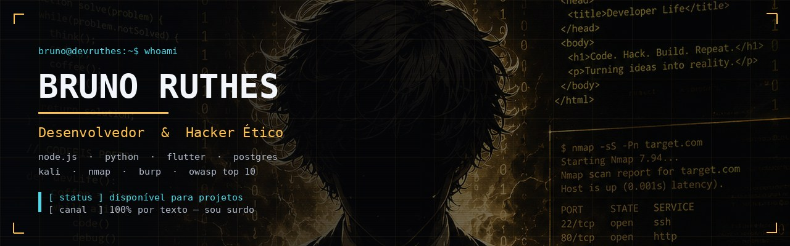

<!-- ============================================================
     BANNER
     ============================================================ -->
<p align="center">
  
</p>

<!-- ============================================================
     LINHA DIGITANDO
     ============================================================ -->
<p align="center">
  
</p>

<!-- ============================================================
     STATUS
     ============================================================ -->
<p align="center">
  
  
  
</p>

<p align="center">
  <a href="https://devruthes.netlify.app"></a>
  <a href="https://www.linkedin.com/in/bruno-ruthes-941346123/"></a>
  
</p>

---

<!-- ============================================================
     HANDSHAKE — a assinatura, igual ao site
     ============================================================ -->
```bash
$ ssh bruno@devruthes -i ~/.ssh/id_ed25519

[ ok ] handshake estabelecido · ed25519
[ .. ] carregando perfil...

  nome     : Bruno Ruthes
  função   : desenvolvedor · full-stack
  perfil   : hacker ético · segurança ofensiva
  canal    : texto · e-mail · whatsapp escrito
  latência : assíncrona por escolha

[ ok ] stack   : node · python · flutter · postgres · supabase
[ ok ] offsec  : kali · nmap · burp · owasp top 10
[ ok ] infra   : linux · nginx · vps hardening · .env

[ !! ] aviso: canal de áudio indisponível neste host
       use texto — resposta em até 24h úteis

$ _
```

---

## `>` Arsenal

<table>
<tr>
<td valign="top" width="50%">

**Backend &amp; APIs**


</td>
<td valign="top" width="50%">

**Dados &amp; Migração**


</td>
</tr>
<tr>
<td valign="top">

**Mobile &amp; Front**


</td>
<td valign="top">

**Infra &amp; Automação**


</td>
</tr>
</table>

---

## `>` Segurança Ofensiva

> Desenvolvedor que só constrói entrega código que passa no teste feliz.
> Eu olho pelo outro lado: o que um atacante faria com esse endpoint, esse formulário, esse token.

<p>
  
  
  
  
</p>

<details>
<summary><b>Kill chain — as 5 fases que eu sigo</b></summary>

<br>

| Fase | O que acontece |
|:---|:---|
| **01 · Recon** | Mapa de domínios, portas, serviços e versões expostas |
| **02 · Enumeração** | Rotas, parâmetros, papéis de usuário e pontos de entrada |
| **03 · Exploração controlada** | Prova de conceito sem derrubar nem vazar dado real |
| **04 · Hardening** | Correção aplicada no código e na configuração do servidor |
| **05 · Reteste** | Confirmo que a falha fechou e registro no relatório final |

```bash
$ nmap -sV -Pn --top-ports 200 alvo.autorizado.br

  PORT      STATE  SERVICE   VERSION
  22/tcp    open   ssh       OpenSSH 9.6
  80/tcp    open   http      nginx 1.24
  443/tcp   open   ssl/http  nginx 1.24
  5432/tcp  open   postgres  PostgreSQL 15   <-- exposto

[ !! ] OWASP A05 · banco acessível pela internet aberta

$ ufw deny 5432/tcp && ufw reload
$ sed -i 's/^#*PermitRootLogin.*/PermitRootLogin no/' sshd_config
$ systemctl reload ssh

[ ok ] porta fechada · login root desativado · reteste agendado
```

</details>

<details>
<summary><b>Regras de engajamento</b></summary>

<br>

| | Regra |
|:---|:---|
| **R.01** | Reconhecimento antes de código — mapeio a superfície de ataque antes de tocar em qualquer coisa |
| **R.02** | Burp Suite no meio da aplicação, para ver o que realmente sai do browser |
| **R.03** | Segredo nunca vive no repositório — `.env` fora do Git, com rotação documentada |
| **R.04** | Hardening: SSH por chave, root desligado, firewall fechado por padrão, log ativo |
| **R.05** | Relatório em português: falha, risco, prova e correção — para o dono do negócio entender |

> **Escopo:** todo teste de intrusão é feito **exclusivamente** em sistemas cujo dono autorizou
> por escrito, com escopo, janela de tempo e limites definidos antes de começar.

</details>

---

## `>` Projetos em produção

| Projeto | O que é | Stack |
|:---|:---|:---|
| **Instituto Vanguarda** | Migração de legado .NET/SQL Server → Node.js/PostgreSQL, 8 módulos, sem parar a operação. Inclui remessa bancária CNAB 240 da Caixa | `Node.js` `PostgreSQL` `CNAB 240` |
| **[ARB-HFT](https://github.com/Bruyen72/HFT)** | Bot de arbitragem de alta frequência: compara preço entre 9 exchanges em tempo real e executa quando o spread cobre taxa e latência | `Python` `WebSocket` `APIs` |
| **[Mik Alimentos](https://mikalimentos.netlify.app/)** | E-commerce completo: catálogo, carrinho, checkout e painel do lojista | `JS` `Node.js` `Netlify` |
| **ESP/MT — AVA** | Ambiente virtual de aprendizagem da Escola de Saúde Pública de MT, tema Boost Union | `Moodle` `PHP` `CSS` |
| **Loja de Eletrônicos** | Front responsivo com backend Node.js, estoque e pedidos em tempo real | `Node.js` `Express` |
| **Data_Auto Scripts** | Scripts que extraem dados em massa e geram relatório pronto — horas de trabalho manual eliminadas | `Python` `VBA` |
| **Rádio Corporativa** | Transmissão de áudio e comunicados internos com baixa latência | `Web` `Streaming` |

<p align="center">
  <a href="https://devruthes.netlify.app#projetos"><b>→ Ver todos com screenshots no portfólio</b></a>
</p>

---

## `>` Como eu trabalho

```
01  Briefing por texto      Você manda o problema. Eu devolvo perguntas objetivas.
02  Escopo e proposta       O que entra, o que não entra, prazo e valor. Por escrito.
03  Entregas em blocos      Cada bloco funciona sozinho, num ambiente de teste que você acessa.
                            Junto: checagem OWASP e segredos fora do código.
04  Deploy e handover       Produção + documento de operação: como rodar, como restaurar,
                            onde ficam as chaves.
```

---

## `>` Comunicação

> **Sou surdo. O projeto inteiro fica escrito.**
>
> Não é limitação a contornar — é o motivo de eu nunca perder um combinado.
> Nada de *"mas na reunião você falou que..."*. Está tudo lá, com data e hora.

| | |
|:---|:---|
| **Tudo por escrito** | WhatsApp e e-mail. Você manda quando puder, eu respondo com a decisão registrada. Nenhuma call em nenhuma etapa. |
| **Histórico é a verdade** | Escopo, mudança de requisito, aprovação — cada item tem mensagem com data. Protege você tanto quanto a mim. |
| **Fuso não trava nada** | Assíncrono por padrão. Cliente de outro estado ou país não precisa achar horário em comum. |
| **Acessibilidade que eu uso** | Contraste, foco de teclado e legenda não são checklist para mim. Eu construo assim porque eu preciso disso. |

---

## `>` Estatísticas

<p align="center">
  
  
</p>

<p align="center">
  
</p>

---

## `>` Contato

<p align="center">
  <a href="https://devruthes.netlify.app#contato">
    
  </a>
  <a href="https://www.linkedin.com/in/bruno-ruthes-941346123/">
    
  </a>
  <a href="https://github.com/Bruyen72">
    
  </a>
</p>

<p align="center">
  <sub><b>Prefiro texto.</b> Se o seu contato for por telefone, não vou conseguir atender —<br>
  use o formulário do site, e-mail ou WhatsApp escrito. Resposta em até 24h úteis.</sub>
</p>

<p align="center">
  <sub><code>Construído à mão, sem framework.</code></sub>
</p>
